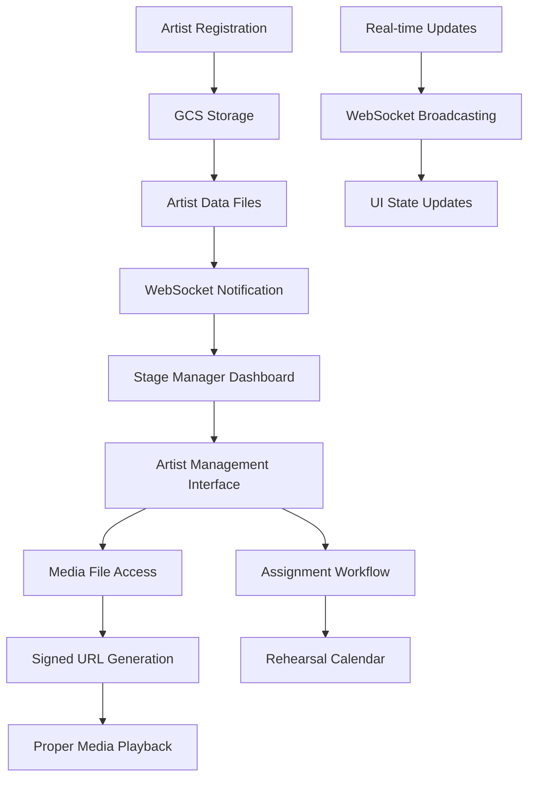

# Design Document

## Overview

This design document outlines the technical implementation for fixing critical issues in the artist management system. The solution addresses real-time WebSocket notifications for artist submissions, proper media file handling with Google Cloud Storage signed URLs, complete artist data integration, and the workflow for assigning artists to rehearsal days.

The design leverages the existing Next.js App Router architecture, WebSocket infrastructure, and Google Cloud Storage integration while fixing media file access issues and implementing real-time notifications for stage managers.

## Architecture

### System Architecture Overview



### Technology Stack

-   **Frontend Framework**: Next.js 14 with App Router
-   **Real-time Communication**: WebSocket (existing infrastructure)
-   **Data Storage**: Google Cloud Storage with proper signed URL handling
-   **Media Processing**: Browser-native audio/video with proper URL handling
-   **State Management**: React Context + WebSocket state
-   **UI Components**: Existing Radix UI components matching sample-ui patterns

### File Structure Changes

```
app/
├── stage-manager/
│   └── events/
│       └── [eventId]/
│           └── artists/
│               └── page.tsx (Enhanced with real-time updates)
├── api/
│   ├── events/
│   │   └── [eventId]/
│   │       └── artists/
│   │           ├── route.ts (Enhanced with WebSocket notifications)
│   │           └── [artistId]/
│   │               └── route.ts (Enhanced with media URL fixes)
│   ├── media/
│   │   └── signed-url/
│   │       └── route.ts (New - for generating fresh signed URLs)
│   └── websocket/
│       └── artist-notifications/
│           └── route.ts (Enhanced for artist submissions)
lib/
├── google-cloud-storage.ts (Enhanced with proper URL handling)
├── websocket-service.ts (Enhanced with artist notifications)
└── media-utils.ts (New - for media file handling)
```

## Components and Interfaces

### 1. Enhanced Artist Management Interface

#### Artist Management Page (`app/stage-manager/events/[eventId]/artists/page.tsx`)

```typescript
interface ArtistManagementProps {
	params: {
		eventId: string;
	};
}

interface ArtistData {
	id: string;
	artistName: string;
	realName: string;
	email: string;
	phone: string;
	style: string;
	performanceType: string;
	performanceDuration: number;
	biography: string;
	eventId: string;
	eventName: string;
	status: "pending" | "approved" | "active" | "inactive";
	performanceDate?: string | null;
	createdAt: string;

	// Technical requirements
	costumeColor: string;
	customCostumeColor?: string;
	lightColorSingle: string;
	lightColorTwo: string;
	lightColorThree: string;
	lightRequests: string;
	stagePositionStart: string;
	stagePositionEnd: string;
	customStagePosition?: string;

	// Media files with proper URLs
	musicTracks: MusicTrack[];
	galleryFiles: GalleryFile[];

	// Social and notes
	socialMedia: SocialMediaLinks;
	mcNotes: string;
	stageManagerNotes: string;
}

interface MusicTrack {
	song_title: string;
	duration: number;
	notes: string;
	is_main_track: boolean;
	tempo: string;
	file_url: string; // Proper signed URL, not blob
	file_path: string; // GCS path for regenerating URLs
}

interface GalleryFile {
	name: string;
	type: "image" | "video";
	url: string; // Proper signed URL, not blob
	file_path: string; // GCS path for regenerating URLs
	size: number;
	uploadedAt: string;
}
```

#### Enhanced Artist Management Component

```typescript
const ArtistManagement: React.FC<ArtistManagementProps> = ({ params }) => {
	const [artists, setArtists] = useState<ArtistData[]>([]);
	const [loading, setLoading] = useState(true);
	const [wsConnected, setWsConnected] = useState(false);
	const { toast } = useToast();

	// WebSocket connection for real-time updates
	useEffect(() => {
		const ws = new WebSocket(`ws://localhost:8080`);

		ws.onopen = () => {
			setWsConnected(true);
			// Authenticate and subscribe to artist notifications
			ws.send(
				JSON.stringify({
					type: "subscribe",
					channel: "artist_submissions",
					eventId: params.eventId,
				})
			);
		};

		ws.onmessage = (event) => {
			const message = JSON.parse(event.data);
			if (message.type === "artist_registered") {
				// Add new artist to the list
				setArtists((prev) => [message.data, ...prev]);
				toast({
					title: "New Artist Registration",
					description: `${message.data.artistName} has submitted their application`,
				});
			} else if (message.type === "artist_updated") {
				// Update existing artist
				setArtists((prev) =>
					prev.map((artist) =>
						artist.id === message.data.id ? message.data : artist
					)
				);
			}
		};

		return () => ws.close();
	}, [params.eventId]);

	// Fetch initial artist data with proper media URLs
	const fetchArtists = async () => {
		try {
			const response = await fetch(
				`/api/events/${params.eventId}/artists`
			);
			const data = await response.json();

			if (data.success) {
				// Ensure all media files have proper signed URLs
				const artistsWithValidUrls = await Promise.all(
					data.artists.map(async (artist: ArtistData) => {
						return await refreshMediaUrls(artist);
					})
				);
				setArtists(artistsWithValidUrls);
			}
		} catch (error) {
			toast({
				title: "Error",
				description: "Failed to load artists",
				variant: "destructive",
			});
		} finally {
			setLoading(false);
		}
	};

	// Function to refresh media URLs when blob URLs are detected
	const refreshMediaUrls = async (
		artist: ArtistData
	): Promise<ArtistData> => {
		const updatedMusicTracks = await Promise.all(
			artist.musicTracks.map(async (track) => {
				if (track.file_url.startsWith("blob:") || !track.file_url) {
					try {
						const response = await fetch("/api/media/signed-url", {
							method: "POST",
							headers: { "Content-Type": "application/json" },
							body: JSON.stringify({ filePath: track.file_path }),
						});
						const { signedUrl } = await response.json();
						return { ...track, file_url: signedUrl };
					} catch (error) {
						console.error(
							"Failed to refresh music track URL:",
							error
						);
						return track;
					}
				}
				return track;
			})
		);

		const updatedGalleryFiles = await Promise.all(
			artist.galleryFiles.map(async (file) => {
				if (file.url.startsWith("blob:") || !file.url) {
					try {
						const response = await fetch("/api/media/signed-url", {
							method: "POST",
							headers: { "Content-Type": "application/json" },
							body: JSON.stringify({ filePath: file.file_path }),
						});
						const { signedUrl } = await response.json();
						return { ...file, url: signedUrl };
					} catch (error) {
						console.error(
							"Failed to refresh gallery file URL:",
							error
						);
						return file;
					}
				}
				return file;
			})
		);

		return {
			...artist,
			musicTracks: updatedMusicTracks,
			galleryFiles: updatedGalleryFiles,
		};
	};

	// Assignment function matching sample UI
	const assignPerformanceDate = async (
		artistId: string,
		performanceDate: string | null
	) => {
		try {
			const response = await fetch(
				`/api/events/${params.eventId}/artists/${artistId}`,
				{
					method: "PATCH",
					headers: { "Content-Type": "application/json" },
					body: JSON.stringify({ performanceDate }),
				}
			);

			if (response.ok) {
				setArtists(
					artists.map((artist) =>
						artist.id === artistId
							? { ...artist, performanceDate }
							: artist
					)
				);

				toast({
					title: performanceDate
						? "Performance date assigned"
						: "Artist unassigned",
					description: performanceDate
						? "Artist has been assigned to a performance date"
						: "Artist has been moved back to submitted applications",
				});
			}
		} catch (error) {
			toast({
				title: "Error",
				description: "Failed to update performance date",
				variant: "destructive",
			});
		}
	};

	// Render UI matching sample-ui/ArtistManagement.tsx exactly
	// ... (UI implementation following the sample pattern)
};
```

### 2. Media File Handling System

#### Signed URL Generation API (`app/api/media/signed-url/route.ts`)

```typescript
import { NextRequest, NextResponse } from "next/server";
import { GCSService } from "@/lib/google-cloud-storage";

export async function POST(request: NextRequest) {
	try {
		const { filePath } = await request.json();

		if (!filePath) {
			return NextResponse.json(
				{ success: false, error: "File path is required" },
				{ status: 400 }
			);
		}

		// Generate signed URL with 24-hour expiration
		const signedUrl = await GCSService.getSignedUrl(filePath, 24 * 60 * 60);

		return NextResponse.json({
			success: true,
			signedUrl,
			expiresAt: new Date(Date.now() + 24 * 60 * 60 * 1000).toISOString(),
		});
	} catch (error) {
		console.error("Error generating signed URL:", error);
		return NextResponse.json(
			{ success: false, error: "Failed to generate signed URL" },
			{ status: 500 }
		);
	}
}
```

#### Enhanced GCS Service (`lib/google-cloud-storage.ts`)

```typescript
export class GCSService {
	/**
	 * Enhanced method to get artist data with proper media URLs
	 */
	static async getArtistData(artistId: string): Promise<any> {
		try {
			const [profile, technical, social, notes, music, gallery] =
				await Promise.all([
					this.readJSON(`artists/${artistId}/profile.json`),
					this.readJSON(`artists/${artistId}/technical.json`),
					this.readJSON(`artists/${artistId}/social.json`),
					this.readJSON(`artists/${artistId}/notes.json`),
					this.readJSON(`artists/${artistId}/music.json`),
					this.readJSON(`artists/${artistId}/gallery.json`),
				]);

			if (!profile) {
				return null;
			}

			// Process music tracks with fresh signed URLs
			const musicTracks = await Promise.all(
				(music?.tracks || []).map(async (track: any) => {
					if (track.file_path) {
						try {
							const signedUrl = await this.getSignedUrl(
								track.file_path,
								24 * 60 * 60
							);
							return {
								...track,
								file_url: signedUrl,
							};
						} catch (error) {
							console.error(
								`Failed to generate signed URL for track: ${track.file_path}`,
								error
							);
							return {
								...track,
								file_url: null, // Will trigger error handling in UI
							};
						}
					}
					return track;
				})
			);

			// Process gallery files with fresh signed URLs
			const galleryFiles = await Promise.all(
				(gallery?.files || []).map(async (file: any) => {
					if (file.file_path) {
						try {
							const signedUrl = await this.getSignedUrl(
								file.file_path,
								24 * 60 * 60
							);
							return {
								...file,
								url: signedUrl,
							};
						} catch (error) {
							console.error(
								`Failed to generate signed URL for file: ${file.file_path}`,
								error
							);
							return {
								...file,
								url: null, // Will trigger error handling in UI
							};
						}
					}
					return file;
				})
			);

			return {
				...profile,
				...technical,
				...social,
				...notes,
				musicTracks,
				galleryFiles,
			};
		} catch (error) {
			console.error("Error getting artist data:", error);
			return null;
		}
	}

	/**
	 * Enhanced file upload with proper path tracking
	 */
	static async uploadFile(
		file: Buffer,
		filename: string,
		folder: string,
		contentType: string
	): Promise<FileUploadResult> {
		try {
			if (!bucket) {
				throw new Error("Google Cloud Storage not initialized");
			}

			const gcsPath = `${folder}/${filename}`;
			const gcsFile = bucket.file(gcsPath);

			await gcsFile.save(file, {
				metadata: {
					contentType,
				},
				public: false,
			});

			// Generate initial signed URL
			const [signedUrl] = await gcsFile.getSignedUrl({
				action: "read",
				expires: Date.now() + 24 * 60 * 60 * 1000, // 24 hours
			});

			return {
				url: signedUrl,
				filename,
				size: file.length,
				contentType,
				gcsPath, // Store the path for future URL generation
			};
		} catch (error) {
			console.error(
				"Error uploading file to Google Cloud Storage:",
				error
			);
			throw new Error("Failed to upload file to Google Cloud Storage");
		}
	}
}
```

### 3. WebSocket Enhancement for Artist Notifications

#### Enhanced WebSocket Service (`lib/websocket-service.ts`)

```typescript
export class WebSocketService {
	/**
	 * Enhanced notification for artist registration with complete data
	 */
	static notifyArtistRegistration(artistData: any) {
		const notification: NotificationMessage = {
			id: `artist_reg_${Date.now()}`,
			type: "artist_registered",
			title: "New Artist Registration",
			message: `${artistData.artistName} has registered for ${artistData.eventName}`,
			data: {
				...artistData,
				// Ensure media URLs are included
				musicTracks: artistData.musicTracks || [],
				galleryFiles: artistData.galleryFiles || [],
			},
			timestamp: new Date().toISOString(),
			recipients: ["super-admin", "stage-manager"],
			eventId: artistData.eventId,
			artistId: artistData.id,
		};

		this.sendNotification(notification);
	}

	/**
	 * Notify when artist is assigned to performance date
	 */
	static notifyArtistAssignment(artistData: any, performanceDate: string) {
		const notification: NotificationMessage = {
			id: `artist_assigned_${Date.now()}`,
			type: "artist_assigned",
			title: "Artist Assigned to Performance",
			message: `${
				artistData.artistName
			} has been assigned to perform on ${new Date(
				performanceDate
			).toLocaleDateString()}`,
			data: {
				artistId: artistData.id,
				artistName: artistData.artistName,
				performanceDate,
				eventId: artistData.eventId,
			},
			timestamp: new Date().toISOString(),
			recipients: ["super-admin", "stage-manager", "artist"],
			eventId: artistData.eventId,
			artistId: artistData.id,
		};

		this.sendNotification(notification);
	}
}
```

#### Enhanced WebSocket Route (`app/api/websocket/route.ts`)

```typescript
// Enhanced to handle artist management subscriptions
wss.on("connection", (ws, request) => {
	console.log("New WebSocket connection");

	ws.on("message", async (message) => {
		try {
			const data = JSON.parse(message.toString());

			if (
				data.type === "subscribe" &&
				data.channel === "artist_submissions"
			) {
				// Subscribe to artist submission notifications for specific event
				const user = authenticatedConnections.get(ws);
				if (
					user &&
					(user.role === "stage_manager" ||
						user.role === "super_admin")
				) {
					// Store subscription info
					ws.eventSubscriptions = ws.eventSubscriptions || new Set();
					ws.eventSubscriptions.add(data.eventId);

					ws.send(
						JSON.stringify({
							type: "subscription_confirmed",
							channel: "artist_submissions",
							eventId: data.eventId,
						})
					);
				}
			}
		} catch (error) {
			console.error("WebSocket message error:", error);
		}
	});
});

// Enhanced broadcasting for artist events
export async function broadcastArtistUpdate(
	eventId: string,
	artistData: any,
	updateType: string
) {
	if (!wss) return;

	for (const [ws, user] of authenticatedConnections.entries()) {
		if (
			ws.readyState === ws.OPEN &&
			(user?.role === "stage_manager" || user?.role === "super_admin") &&
			ws.eventSubscriptions?.has(eventId)
		) {
			try {
				ws.send(
					JSON.stringify({
						type: updateType,
						data: artistData,
						eventId,
						timestamp: new Date().toISOString(),
					})
				);
			} catch (e) {
				console.error("Error broadcasting artist update:", e);
			}
		}
	}
}
```

### 4. Media Player Components

#### Enhanced Audio Player Component

```typescript
interface AudioPlayerProps {
	track: MusicTrack;
	onError?: (error: string) => void;
}

const AudioPlayer: React.FC<AudioPlayerProps> = ({ track, onError }) => {
	const [isPlaying, setIsPlaying] = useState(false);
	const [error, setError] = useState<string | null>(null);
	const audioRef = useRef<HTMLAudioElement>(null);

	const handlePlay = async () => {
		if (!track.file_url || track.file_url.startsWith("blob:")) {
			// Attempt to refresh the URL
			try {
				const response = await fetch("/api/media/signed-url", {
					method: "POST",
					headers: { "Content-Type": "application/json" },
					body: JSON.stringify({ filePath: track.file_path }),
				});
				const { signedUrl } = await response.json();

				if (audioRef.current) {
					audioRef.current.src = signedUrl;
					audioRef.current.play();
					setIsPlaying(true);
				}
			} catch (error) {
				const errorMsg = "Failed to load audio file";
				setError(errorMsg);
				onError?.(errorMsg);
			}
		} else {
			audioRef.current?.play();
			setIsPlaying(true);
		}
	};

	const handlePause = () => {
		audioRef.current?.pause();
		setIsPlaying(false);
	};

	const handleError = () => {
		const errorMsg = "Audio file could not be played";
		setError(errorMsg);
		setIsPlaying(false);
		onError?.(errorMsg);
	};

	return (
		<div className="flex items-center gap-2">
			<Button
				variant="outline"
				size="sm"
				onClick={isPlaying ? handlePause : handlePlay}
				disabled={!!error}
			>
				{isPlaying ? (
					<Pause className="h-4 w-4" />
				) : (
					<Play className="h-4 w-4" />
				)}
			</Button>

			<audio
				ref={audioRef}
				src={track.file_url}
				onEnded={() => setIsPlaying(false)}
				onError={handleError}
				preload="none"
			/>

			<div className="flex-1">
				<p className="font-medium">{track.song_title}</p>
				<p className="text-sm text-muted-foreground">
					Duration: {formatDuration(track.duration)} • Tempo:{" "}
					{track.tempo}
				</p>
				{error && <p className="text-sm text-destructive">{error}</p>}
			</div>
		</div>
	);
};
```

#### Enhanced Video Player Component

```typescript
interface VideoPlayerProps {
	file: GalleryFile;
	onError?: (error: string) => void;
}

const VideoPlayer: React.FC<VideoPlayerProps> = ({ file, onError }) => {
	const [error, setError] = useState<string | null>(null);
	const [videoUrl, setVideoUrl] = useState(file.url);

	const handleError = async () => {
		if (file.url.startsWith("blob:") || !file.url) {
			// Attempt to refresh the URL
			try {
				const response = await fetch("/api/media/signed-url", {
					method: "POST",
					headers: { "Content-Type": "application/json" },
					body: JSON.stringify({ filePath: file.file_path }),
				});
				const { signedUrl } = await response.json();
				setVideoUrl(signedUrl);
			} catch (error) {
				const errorMsg = "Failed to load video file";
				setError(errorMsg);
				onError?.(errorMsg);
			}
		} else {
			const errorMsg = "Video file could not be played";
			setError(errorMsg);
			onError?.(errorMsg);
		}
	};

	if (error) {
		return (
			<div className="aspect-video bg-muted rounded-lg flex items-center justify-center">
				<div className="text-center">
					<p className="text-sm text-destructive">{error}</p>
					<Button
						variant="outline"
						size="sm"
						onClick={() => {
							setError(null);
							handleError();
						}}
						className="mt-2"
					>
						Retry
					</Button>
				</div>
			</div>
		);
	}

	return (
		<video
			src={videoUrl}
			controls
			className="w-full aspect-video rounded-lg"
			onError={handleError}
			preload="metadata"
		>
			Your browser does not support the video element.
		</video>
	);
};
```

## Data Models

### Enhanced Artist Data Model

```typescript
interface CompleteArtistData {
	// Basic Information
	id: string;
	artistName: string;
	realName: string;
	email: string;
	phone: string;
	style: string;
	performanceType: string;
	performanceDuration: number;
	biography: string;

	// Event Association
	eventId: string;
	eventName: string;
	status: "pending" | "approved" | "active" | "inactive";
	performanceDate?: string | null;

	// Timestamps
	createdAt: string;
	updatedAt: string;
	lastLogin?: string;

	// Technical Requirements
	costumeColor: string;
	customCostumeColor?: string;
	lightColorSingle: string;
	lightColorTwo: string;
	lightColorThree: string;
	lightRequests: string;
	stagePositionStart: string;
	stagePositionEnd: string;
	customStagePosition?: string;
	equipment?: string;
	specialRequirements?: string;

	// Media Files (with proper URLs)
	musicTracks: EnhancedMusicTrack[];
	galleryFiles: EnhancedGalleryFile[];

	// Social Media and Links
	socialMedia: {
		instagram?: string;
		facebook?: string;
		youtube?: string;
		tiktok?: string;
		website?: string;
	};
	showLink?: string;

	// Notes and Communication
	mcNotes: string;
	stageManagerNotes: string;
	notes?: string;
}

interface EnhancedMusicTrack {
	song_title: string;
	duration: number;
	notes: string;
	is_main_track: boolean;
	tempo: string;
	file_url: string; // Proper signed URL
	file_path: string; // GCS path for URL regeneration
	uploadedAt: string;
	fileSize: number;
	contentType: string;
}

interface EnhancedGalleryFile {
	name: string;
	type: "image" | "video";
	url: string; // Proper signed URL
	file_path: string; // GCS path for URL regeneration
	size: number;
	uploadedAt: string;
	contentType: string;
	thumbnail?: string; // For videos
}
```

### WebSocket Message Types for Artist Management

```typescript
interface ArtistWebSocketMessage {
	type:
		| "artist_registered"
		| "artist_updated"
		| "artist_assigned"
		| "artist_deleted";
	data: CompleteArtistData;
	eventId: string;
	timestamp: string;
	userId?: string;
}

interface ArtistRegisteredMessage extends ArtistWebSocketMessage {
	type: "artist_registered";
	data: CompleteArtistData;
}

interface ArtistAssignedMessage extends ArtistWebSocketMessage {
	type: "artist_assigned";
	data: CompleteArtistData & {
		performanceDate: string;
		assignedBy: string;
	};
}
```

## Error Handling

### Media File Error Handling

```typescript
class MediaErrorHandler {
	static async handleBlobUrlError(filePath: string): Promise<string | null> {
		try {
			const response = await fetch("/api/media/signed-url", {
				method: "POST",
				headers: { "Content-Type": "application/json" },
				body: JSON.stringify({ filePath }),
			});

			if (!response.ok) {
				throw new Error(`HTTP ${response.status}`);
			}

			const { signedUrl } = await response.json();
			return signedUrl;
		} catch (error) {
			console.error("Failed to generate signed URL:", error);
			return null;
		}
	}

	static getErrorMessage(error: any): string {
		if (error.code === "ENOENT") {
			return "File not found in storage";
		} else if (error.code === "EACCES") {
			return "Access denied to file";
		} else if (error.message?.includes("network")) {
			return "Network error - please check your connection";
		} else {
			return "Unable to load media file";
		}
	}
}
```

### WebSocket Error Handling

```typescript
class WebSocketErrorHandler {
	private static retryCount = 0;
	private static maxRetries = 5;

	static handleConnectionError(ws: WebSocket, onReconnect: () => void) {
		ws.onerror = (error) => {
			console.error("WebSocket error:", error);
		};

		ws.onclose = (event) => {
			if (this.retryCount < this.maxRetries) {
				const delay = Math.pow(2, this.retryCount) * 1000; // Exponential backoff
				setTimeout(() => {
					this.retryCount++;
					onReconnect();
				}, delay);
			} else {
				console.error("Max WebSocket reconnection attempts reached");
			}
		};

		ws.onopen = () => {
			this.retryCount = 0; // Reset on successful connection
		};
	}
}
```

## Testing Strategy

### Unit Testing

#### Media URL Generation Testing

```typescript
describe("MediaUrlGeneration", () => {
	it("should generate valid signed URLs for music tracks", async () => {
		const mockTrack = {
			file_path: "artists/123/music/track.mp3",
			song_title: "Test Song",
		};

		const signedUrl = await GCSService.getSignedUrl(mockTrack.file_path);

		expect(signedUrl).toBeDefined();
		expect(signedUrl).not.toContain("blob:");
		expect(signedUrl).toContain("googleapis.com");
	});

	it("should handle blob URL replacement", async () => {
		const artist = {
			musicTracks: [
				{
					file_url: "blob:http://localhost:3000/123-456",
					file_path: "artists/123/music/track.mp3",
				},
			],
		};

		const updatedArtist = await refreshMediaUrls(artist);

		expect(updatedArtist.musicTracks[0].file_url).not.toContain("blob:");
	});
});
```

#### WebSocket Notification Testing

```typescript
describe("WebSocketNotifications", () => {
	it("should send artist registration notifications", () => {
		const mockArtist = {
			id: "123",
			artistName: "Test Artist",
			eventId: "event123",
		};

		const sendNotificationSpy = jest.spyOn(
			WebSocketService,
			"sendNotification"
		);

		WebSocketService.notifyArtistRegistration(mockArtist);

		expect(sendNotificationSpy).toHaveBeenCalledWith(
			expect.objectContaining({
				type: "artist_registered",
				data: expect.objectContaining(mockArtist),
			})
		);
	});
});
```

### Integration Testing

#### Artist Management API Testing

```typescript
describe("/api/events/[eventId]/artists", () => {
	it("should return artists with valid media URLs", async () => {
		const response = await fetch("/api/events/123/artists");
		const data = await response.json();

		expect(response.status).toBe(200);
		expect(data.success).toBe(true);

		data.artists.forEach((artist) => {
			artist.musicTracks.forEach((track) => {
				expect(track.file_url).not.toContain("blob:");
				if (track.file_url) {
					expect(track.file_url).toContain("googleapis.com");
				}
			});
		});
	});
});
```

### End-to-End Testing

#### Artist Management Workflow

```typescript
describe("Artist Management E2E", () => {
	it("should handle complete artist management workflow", async () => {
		// Artist registers
		await page.goto("/artist-register/event123");
		await page.fill('[data-testid="artist-name"]', "Test Artist");
		await page.click('[data-testid="submit"]');

		// Stage manager sees notification
		await page.goto("/stage-manager/events/event123/artists");
		await expect(
			page.locator('[data-testid="notification-badge"]')
		).toBeVisible();

		// Stage manager assigns artist
		await page.selectOption('[data-testid="assign-date"]', "2024-01-15");

		// Verify artist moved to assigned section
		await expect(
			page.locator('[data-testid="assigned-artists"]')
		).toContainText("Test Artist");
	});
});
```

## Performance Considerations

### Media File Optimization

-   **Lazy Loading**: Load media files only when needed
-   **URL Caching**: Cache signed URLs with appropriate TTL
-   **Progressive Loading**: Load thumbnails first, full media on demand
-   **Compression**: Optimize media file sizes during upload

### WebSocket Optimization

-   **Connection Pooling**: Reuse WebSocket connections
-   **Message Batching**: Batch multiple updates to reduce message frequency
-   **Selective Broadcasting**: Only send updates to relevant subscribers
-   **Heartbeat Mechanism**: Implement ping/pong for connection health

### GCS Integration Optimization

-   **Batch Operations**: Group multiple GCS operations
-   **Parallel Fetching**: Fetch multiple artist profiles concurrently
-   **Error Recovery**: Implement retry logic for failed operations
-   **Data Compression**: Compress large artist profile data

## Security Considerations

### Media File Security

-   **Signed URL Expiration**: Use appropriate expiration times (24 hours)
-   **Access Control**: Verify user permissions before generating URLs
-   **File Type Validation**: Validate file types and sizes
-   **Content Scanning**: Scan uploaded files for malicious content

### WebSocket Security

-   **Authentication**: Verify JWT tokens for all WebSocket connections
-   **Authorization**: Check user roles before sending notifications
-   **Rate Limiting**: Limit message frequency per connection
-   **Input Validation**: Validate all incoming WebSocket messages

### API Security

-   **Parameter Validation**: Validate all API parameters
-   **SQL Injection Prevention**: Use parameterized queries
-   **CORS Configuration**: Configure CORS appropriately
-   **Error Information**: Don't expose sensitive error details
