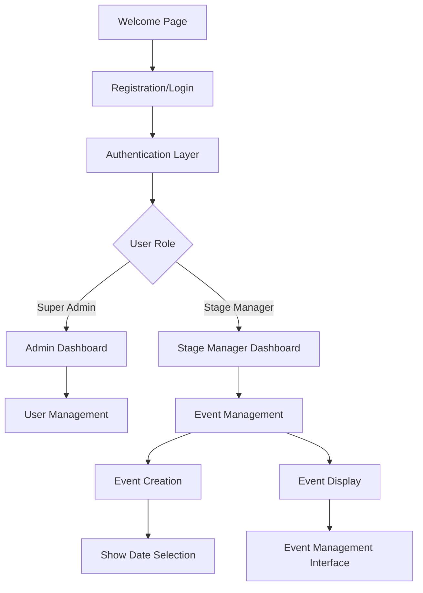

# Design Document

## Overview

The Event Management System will be built as a comprehensive Next.js application with role-based access control, featuring animated interfaces and intuitive user workflows. The system leverages the existing authentication infrastructure while extending it with new event management capabilities.

The application follows a modular architecture with clear separation between authentication, event management, and user interface layers. It utilizes React Server Components where appropriate and client-side interactivity for dynamic features.

## Architecture

### Technology Stack

-   **Frontend Framework**: Next.js 14 with App Router
-   **UI Components**: Radix UI primitives with custom styling
-   **Styling**: Tailwind CSS with custom animations
-   **Animation Library**: Framer Motion (to be added)
-   **Form Handling**: React Hook Form with Zod validation
-   **Date Management**: date-fns with react-day-picker
-   **State Management**: React Context for authentication, local state for components
-   **Authentication**: JWT-based with existing AuthProvider pattern

### System Architecture



### Directory Structure

```
app/
├── page.tsx (Enhanced Welcome Page)
├── register/
├── login/
├── stage-manager/
│   ├── page.tsx (Dashboard)
│   ├── events/
│   │   ├── page.tsx (Events List)
│   │   ├── create/
│   │   │   └── page.tsx (Event Creation)
│   │   └── [id]/
│   │       ├── page.tsx (Event Management)
│   │       └── edit/
│   │           └── page.tsx (Event Editing)
├── super-admin/
│   └── stage-managers/ (Enhanced User Management)
└── api/
    ├── auth/ (Existing)
    └── events/ (New Event APIs)
```

## Components and Interfaces

### Core Components

#### 1. Enhanced Welcome Page (`app/page.tsx`)

-   **Purpose**: Animated landing page with Framer Motion
-   **Features**:
    -   Hero section with fade-in animations
    -   Staggered feature cards
    -   Smooth scroll animations
    -   Call-to-action buttons with hover effects
-   **Dependencies**: Framer Motion, existing UI components

#### 2. Event Management Components

```typescript
// Event Card Component
interface EventCardProps {
	event: Event;
	onManage: (eventId: string) => void;
	onEdit: (eventId: string) => void;
	onDelete: (eventId: string) => void;
}

// Event Creation Form
interface EventFormData {
	name: string;
	venueName: string;
	startDate: Date;
	endDate: Date;
	description: string;
}

// Show Date Selection Modal
interface ShowDateModalProps {
	eventName: string;
	startDate: Date;
	endDate: Date;
	onSave: (dates: Date[]) => void;
	onSkip: () => void;
}
```

#### 3. Dashboard Components

```typescript
// Stage Manager Dashboard Card
interface DashboardCardProps {
	title: string;
	description: string;
	buttonText: string;
	onClick: () => void;
	icon?: React.ReactNode;
}

// Event Management Interface
interface EventManagementProps {
	eventId: string;
	event: Event;
}
```

### Animation System

#### Framer Motion Integration

-   **Page Transitions**: Smooth transitions between routes
-   **Component Animations**: Staggered animations for cards and lists
-   **Micro-interactions**: Button hover effects, form field focus states
-   **Loading States**: Skeleton animations and loading spinners

```typescript
// Animation Variants
const fadeInUp = {
	initial: { opacity: 0, y: 60 },
	animate: { opacity: 1, y: 0 },
	transition: { duration: 0.6 },
};

const staggerContainer = {
	animate: {
		transition: {
			staggerChildren: 0.1,
		},
	},
};
```

## Data Models

### Event Model

```typescript
interface Event {
	id: string;
	name: string;
	venueName: string;
	startDate: Date;
	endDate: Date;
	description: string;
	stageManagerId: string;
	showDates: Date[];
	status: "draft" | "active" | "completed" | "cancelled";
	createdAt: Date;
	updatedAt: Date;
}
```

### User Model (Extended)

```typescript
interface User {
	id: string;
	email: string;
	name: string;
	role: "super_admin" | "stage_manager" | "artist" | "dj" | "mc" | "graphics";
	accountStatus: "pending" | "approved" | "suspended" | "deactivated";
	eventId?: string;
	subscriptionStatus?: string;
	subscriptionEndDate?: string;
	createdAt: Date;
	lastLogin?: Date;
}
```

### Show Date Model

```typescript
interface ShowDate {
	id: string;
	eventId: string;
	date: Date;
	status: "scheduled" | "completed" | "cancelled";
	notes?: string;
}
```

## Error Handling

### Client-Side Error Handling

-   **Form Validation**: Zod schemas with React Hook Form
-   **API Error Handling**: Centralized error handling with toast notifications
-   **Route Protection**: Authentication guards for protected routes
-   **Fallback UI**: Error boundaries for component failures

### Server-Side Error Handling

-   **API Route Errors**: Structured error responses with appropriate HTTP status codes
-   **Authentication Errors**: JWT validation and refresh token handling
-   **Database Errors**: Graceful handling of database connection issues
-   **Validation Errors**: Input validation with detailed error messages

### Error Response Format

```typescript
interface ApiError {
	success: false;
	error: {
		code: string;
		message: string;
		details?: any;
	};
}

interface ApiSuccess<T> {
	success: true;
	data: T;
}
```

## Testing Strategy

### Unit Testing

-   **Component Testing**: React Testing Library for UI components
-   **Hook Testing**: Custom hooks testing with React Hooks Testing Library
-   **Utility Functions**: Jest for pure function testing
-   **Form Validation**: Zod schema testing

### Integration Testing

-   **API Route Testing**: Next.js API route testing
-   **Authentication Flow**: End-to-end authentication testing
-   **Event Management Flow**: Complete event creation and management workflows

### E2E Testing

-   **User Journeys**: Complete user workflows from registration to event management
-   **Cross-browser Testing**: Ensure compatibility across different browsers
-   **Mobile Responsiveness**: Test responsive design on various screen sizes

### Testing Tools

-   **Jest**: Unit testing framework
-   **React Testing Library**: Component testing
-   **Playwright**: End-to-end testing
-   **MSW**: API mocking for tests

## Performance Considerations

### Optimization Strategies

-   **Code Splitting**: Dynamic imports for heavy components
-   **Image Optimization**: Next.js Image component with proper sizing
-   **Bundle Analysis**: Regular bundle size monitoring
-   **Caching**: Appropriate caching strategies for API responses

### Animation Performance

-   **Hardware Acceleration**: Use transform and opacity for animations
-   **Reduced Motion**: Respect user's motion preferences
-   **Animation Cleanup**: Proper cleanup of animation listeners
-   **Lazy Loading**: Load animations only when needed

## Security Considerations

### Authentication Security

-   **JWT Security**: Secure token storage and validation
-   **Role-based Access**: Proper authorization checks
-   **Session Management**: Secure session handling
-   **Password Security**: Proper password hashing and validation

### Data Protection

-   **Input Sanitization**: Prevent XSS attacks
-   **SQL Injection Prevention**: Parameterized queries
-   **CSRF Protection**: Cross-site request forgery prevention
-   **Rate Limiting**: API rate limiting for abuse prevention

## Accessibility

### WCAG Compliance

-   **Keyboard Navigation**: Full keyboard accessibility
-   **Screen Reader Support**: Proper ARIA labels and roles
-   **Color Contrast**: Sufficient color contrast ratios
-   **Focus Management**: Proper focus handling in modals and forms

### Animation Accessibility

-   **Reduced Motion**: Respect prefers-reduced-motion setting
-   **Focus Indicators**: Clear focus indicators for interactive elements
-   **Alternative Text**: Proper alt text for images and icons
